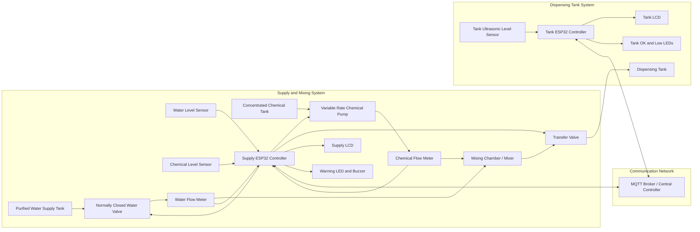
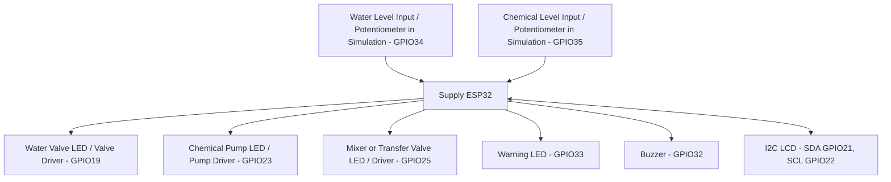
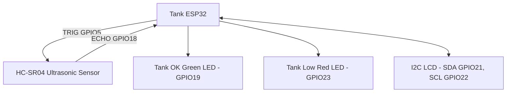
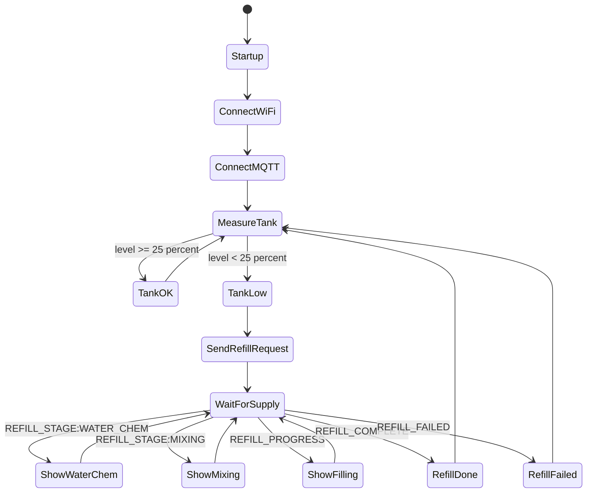
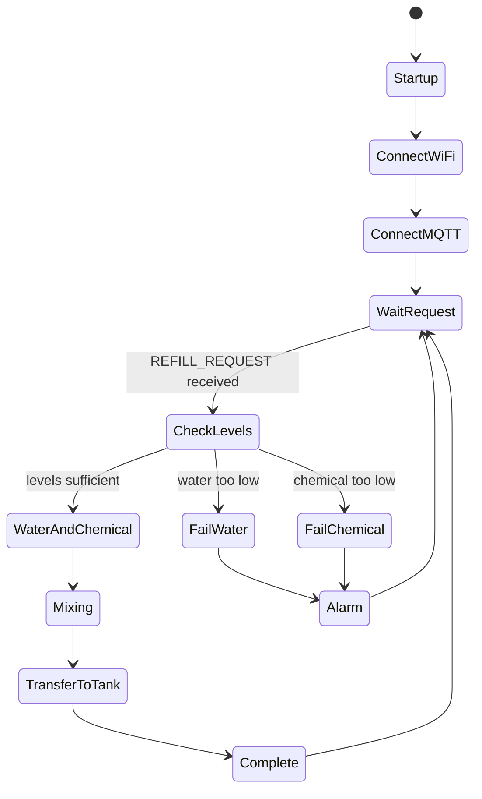

# IoT Based Purified Water and Chemical Dispensing System

## Project Overview

This project implements an IoT based automatic refill system for hospital dispensing tanks. A dispensing tank continuously measures its water level. When the level becomes low, it sends a refill request to the supply controller. The supply controller checks the purified water and concentrated chemical availability, opens the water valve and chemical pump, mixes the liquids, and then transfers the mixture to the dispensing tank. Status information is sent back to the dispensing tank and displayed using LCDs and LEDs.

The implemented Wokwi simulation uses one dispensing tank, one supply controller, MQTT communication, ESP32 controllers, LCD displays, LEDs, potentiometers for supply tank levels, and an ultrasonic level sensor for the dispensing tank.

## Chapter 1: Water Level and Chemical Level Measurement Methods

The purified water supply tank and chemical supply tanks require reliable level measurement. The chosen methods must be low cost, safe for liquids, easy to interface with an ESP32, and suitable for future scaling to multiple tanks.

For the dispensing tank, a non-contact ultrasonic level sensor is suitable. The sensor is mounted at the top of the tank and measures the distance from the sensor to the liquid surface. The controller converts this distance into level percentage:

```text
liquid height = tank height - measured distance
level percentage = liquid height / tank height * 100
```

This method is suitable because the sensor does not touch the purified water, reducing contamination risk. In the simulation, the HC-SR04 ultrasonic sensor is used because Wokwi supports it and it is simple to demonstrate. For a real system, a waterproof ultrasonic sensor or industrial pressure level sensor is recommended.

For the purified water supply tank, a waterproof ultrasonic sensor is recommended for medium sized tanks where non-contact measurement is preferred. A product such as the DFRobot A02YYUW waterproof ultrasonic sensor is suitable because it is IP67 rated, supports 3 cm to 450 cm distance measurement, and communicates through UART.

For concentrated chemical tanks, a submersible industrial pressure level sensor is recommended. Concentrated chemicals may create vapor, foam, or surface disturbance that can reduce ultrasonic accuracy. A stainless steel submersible pressure sensor outputs a stable analog signal based on hydrostatic pressure and can be selected with chemically compatible materials.

Final selection:

| Tank | Recommended method | Reason |
|---|---|---|
| Dispensing tank | Waterproof ultrasonic level sensor | Non-contact, low contamination risk, easy to simulate and install |
| Purified water supply tank | Waterproof ultrasonic or pressure level sensor | Large tank level measurement without contact or with industrial robustness |
| Concentrated chemical tank | Chemical-compatible pressure level sensor or load cell | More reliable for chemical tanks where foam/vapor can affect ultrasonic sensors |

## Chapter 2: Component Identification, Product Evaluation, and Final Selection

The system requires control valves, flow meters, a variable rate pump, level sensors, controllers, alarms, and display components. Prices below are approximate USD prices checked from market/vendor product pages in May 2026 and should be rechecked before procurement.

### Control Valves

| Product | Approx. cost | Features | Evaluation |
|---|---:|---|---|
| Adafruit Plastic Water Solenoid Valve, 12 V, 1/2 inch | USD 6.95 | Normally closed, low cost, suitable for water | Best for prototype and purified water line |
| Generic 12 V brass solenoid valve, 1/2 inch | USD 8-15 | Stronger body, better durability than plastic | Better for real installation if liquid is compatible |
| Industrial 24 V DC stainless steel solenoid valve | USD 25-60 | More durable, industrial voltage, better sealing | Best for final hospital plant but higher cost |

Final choice: normally closed solenoid valves. Normally closed valves are safer because they shut when power fails.

### Flow Meters

| Product | Approx. cost | Features | Evaluation |
|---|---:|---|---|
| Adafruit Liquid Flow Meter, 1/2 inch NPS | USD 9.95 | Hall effect pulse output, 1-30 L/min range | Good prototype choice, needs calibration |
| YF-S201 Hall effect water flow sensor | USD 3-8 | Very common, cheap, pulse output | Good low-cost option, lower accuracy |
| Industrial turbine flow meter with pulse or 4-20 mA output | USD 30-100 | Better accuracy and durability | Best for final system where dosage accuracy is important |

Final choice: Hall effect turbine flow meter for prototype; industrial pulse or 4-20 mA flow meter for deployment.

### Variable Rate Pump

| Product | Approx. cost | Features | Evaluation |
|---|---:|---|---|
| Adafruit 12 V peristaltic liquid pump | USD 24.95 | Fluid does not contact pump mechanism, PWM speed control possible, up to about 100 mL/min | Best prototype chemical dosing pump |
| DFRobot peristaltic pump module | USD 15-25 | Arduino-friendly, suitable for liquid dosing | Good low-cost alternative |
| Industrial chemical dosing peristaltic pump | USD 80-250 | Better chemical compatibility, adjustable flow, long duty cycle | Best final installation choice |

Final choice: peristaltic variable rate pump for chemical dosing. A peristaltic pump is preferred because only the tube contacts the chemical, reducing contamination and corrosion.

### Dispensing Tank Level Sensors

| Product | Approx. cost | Features | Evaluation |
|---|---:|---|---|
| HC-SR04 ultrasonic sensor | USD 2-5 | Low cost, easy ESP32 interface | Good for Wokwi simulation only; not waterproof |
| DFRobot A02YYUW IP67 ultrasonic sensor | USD 15.90 | Waterproof, UART output, 3-450 cm range | Best real prototype choice |
| Industrial submersible pressure level sensor, 0-5 m | USD 40-120 | Robust, analog output, suitable for tanks | Best for industrial deployment |

Final choice: waterproof ultrasonic level sensor for dispensing tanks. Use pressure level sensor if the tank has foam, vapor, or poor ultrasonic reflection.

### Controller and Additional Components

| Product | Approx. cost | Features | Evaluation |
|---|---:|---|---|
| ESP32 DevKit / ESP32 Feather HUZZAH32 | USD 8-20 / USD 19.95 | WiFi, Bluetooth, ADC, GPIO, Arduino support | Best for prototype and Wokwi |
| ESP32 LoRa board, such as Heltec WiFi LoRa 32 | USD 18-30 | WiFi plus LoRa for longer distance | Good for large hospital/building areas |
| Industrial PLC or DIN rail ESP32 controller | USD 60-200 | Better enclosure, terminals, power protection | Best for final installation |

Additional components:

| Component | Purpose |
|---|---|
| 16x2 I2C LCD | Local level/status display |
| LEDs | Visual indication for tank OK, tank low, water valve active, chemical pump active, mixer active, warning |
| Buzzer | Audible fault warning |
| Relay or MOSFET driver board | Drives valves and pumps safely from ESP32 outputs |
| Flyback diode | Protects controller from solenoid and relay inductive voltage |
| 12 V / 24 V power supply | Powers valves and pumps |
| Emergency stop switch | Allows manual shutdown |

## Chapter 3: Failure Detection and Fail-Safe Methods

The system must detect failures before they create overflow, wrong mixture ratio, dry running, or chemical over-dosing. Detection should combine sensor checks and algorithmic checks.

| Potential failure | Detection method | Fail-safe action |
|---|---|---|
| Dispensing tank level sensor stuck | Level reading does not change during filling; reading outside physical range | Stop refill, close valves, raise alarm |
| Water supply tank empty | Water level sensor below minimum or no flow while water valve is open | Stop chemical pump and water valve, send refill failed status |
| Chemical tank empty | Chemical level sensor below minimum or no chemical flow during dosing | Stop all outputs, raise chemical low alarm |
| Water valve stuck closed | Valve command ON but flow meter shows zero flow | Stop sequence, alarm valve failure |
| Water valve stuck open | Valve command OFF but flow meter still shows flow or tank level keeps increasing | Cut main supply using master shutoff valve, alarm |
| Chemical pump failure | Pump command ON but chemical flow/level does not change | Stop process, alarm pump failure |
| Mixer failure | Mixer command ON but motor current or speed feedback is missing | Stop transfer to dispensing tank, alarm mixer failure |
| Communication failure | MQTT heartbeat missing or no response after request timeout | Keep all actuators OFF; dispensing tank remains in low-level warning state |
| Wrong chemical ratio | Flow meter totals do not match programmed ratio | Stop transfer, drain/hold batch, alarm |
| Power failure | Controller restarts or supply voltage drops | Normally closed valves shut automatically; controller restarts in safe OFF state |
| Tank overflow risk | Level above high threshold or level continues rising after completion | Close valves, stop pump, activate alarm |

Recommended fail-safe design:

1. Use normally closed valves.
2. Add a physical overflow pipe or high level float switch as independent protection.
3. Require both level sensor and flow meter confirmation before continuing a refill.
4. Use watchdog timers in each controller.
5. Store actuator outputs OFF during startup.
6. Use timeout limits for each state.
7. Log every failure to the central controller.

## Chapter 4: Data Collection and Communication to a Central Controller

Dispensing tanks may be distributed across a building. The communication method must support tank level messages, refill requests, refill progress, alarms, and controller health status.

### Method 1: WiFi and MQTT

WiFi with MQTT is used in the current simulation. Each tank controller connects to the hospital WiFi network and publishes messages to a broker. The central controller subscribes to topics such as:

```text
hospital/refill/request
hospital/refill/status
hospital/tank/+/level
hospital/tank/+/alarm
```

Advantages:

| Advantage | Explanation |
|---|---|
| Low cost | ESP32 has built-in WiFi |
| Easy integration | MQTT works well with dashboards and databases |
| Scalable topic structure | Many tanks can publish to separate topics |
| Supported in Wokwi | Easy to demonstrate |

Disadvantages:

| Disadvantage | Explanation |
|---|---|
| Depends on WiFi coverage | Weak signal may cause dropouts |
| Requires network security | Needs TLS, authentication, and network isolation |
| Power consumption | Higher than some low-power radio methods |

### Method 2: LoRa / LoRaWAN

LoRa is suitable when tanks are far apart, located in separate buildings, or WiFi is not available. Each tank sends small level and alarm packets to a LoRa gateway, which forwards them to the central controller.

Advantages:

| Advantage | Explanation |
|---|---|
| Long range | Better than WiFi for distributed tanks |
| Low power | Suitable for battery assisted monitoring nodes |
| Good penetration | Useful in large sites |

Disadvantages:

| Disadvantage | Explanation |
|---|---|
| Lower data rate | Not suitable for large data payloads |
| Gateway required | Adds cost and setup complexity |
| More complex integration | Requires LoRaWAN server or custom gateway software |

### Method 3: Zigbee Mesh

Zigbee can be used where many tanks are distributed around wards and corridors. Nodes form a mesh network, allowing messages to hop between devices.

Advantages:

| Advantage | Explanation |
|---|---|
| Mesh support | Useful for many nodes in a building |
| Low power | Good for sensor nodes |
| Mature ecosystem | Many modules and gateways available |

Disadvantages:

| Disadvantage | Explanation |
|---|---|
| Extra module needed | ESP32 does not include Zigbee in common versions |
| Gateway required | Central gateway needed |
| More setup effort | Mesh planning is required |

Final recommendation: use WiFi/MQTT for the prototype and areas with strong hospital WiFi. Use LoRaWAN for long distance or separated buildings. Zigbee is an alternative for dense indoor mesh networks.

## Chapter 5: Complete Schematic Block Diagram



## Chapter 6: Controller and Sensor Schematic Diagram

### Supply Controller Connections



### Dispensing Tank Controller Connections



## Chapter 7: State Diagrams and Operational Algorithms

### Dispensing Tank IoT Component Algorithm



### Supply Controller IoT Component Algorithm



### Algorithm Description

1. Tank controller reads tank level.
2. If tank level is below 25 percent, red LED turns ON and a refill request is published through MQTT.
3. Supply controller receives the request and checks purified water and chemical levels.
4. If water or chemical is low, all outputs remain OFF and an alarm is shown.
5. If resources are sufficient, the water valve and chemical pump turn ON.
6. After the dosing stage, the mixer turns ON.
7. The mixed liquid is transferred to the dispensing tank.
8. Refill progress is sent to the tank controller.
9. When refill completes, the tank shows 100 percent and the green LED turns ON.

## Chapter 8: Wokwi Simulation Implementation and Source Code Attachment

The solution was simulated using Wokwi and PlatformIO with one dispensing tank. Two ESP32 programs are used:

| File | Purpose |
|---|---|
| `src/tank_controller.cpp` | Dispensing tank controller: reads ultrasonic level, requests refill, receives progress, updates LCD and LEDs |
| `src/supply_controller.cpp` | Supply controller: checks water and chemical levels, controls water valve LED, chemical pump LED, mixer LED, alarm LED, and buzzer |
| `platformio.ini` | Defines separate PlatformIO environments for tank and supply builds |
| `diagram_tank.json` | Wokwi dispensing tank wiring |
| `diagram_supply.json` | Wokwi supply controller wiring |

Simulation components:

| Component | Wokwi part |
|---|---|
| Controller | ESP32 DevKit |
| Tank level sensor | HC-SR04 ultrasonic sensor |
| Supply tank level inputs | Potentiometers |
| Local display | 16x2 I2C LCD |
| Valve/pump/mixer status | LEDs |
| Fault alarm | LED and buzzer |
| Communication | WiFi MQTT using HiveMQ Cloud broker |

Build commands:

```powershell
pio run -e esp_tank
pio run -e esp_supply
```

The current source code is attached in the project source folder:

```text
Hospital230515N/
  src/
    tank_controller.cpp
    supply_controller.cpp
  platformio.ini
  diagram_tank.json
  diagram_supply.json
  wokwi_tank.toml
  wokwi_supply.toml
```

## References

1. Adafruit, Plastic Water Solenoid Valve - 12 V - 1/2 inch nominal, https://www.adafruit.com/product/997
2. Adafruit, Liquid Flow Meter - Plastic 1/2 inch NPS threaded, https://www.adafruit.com/product/828
3. Adafruit, Peristaltic Liquid Pump with Silicone Tubing - 12 V DC, https://www.adafruit.com/product/1150
4. DFRobot, A02YYUW Waterproof Ultrasonic Sensor for Arduino / ESP32, https://www.dfrobot.com/product-1935.html
5. DFRobot, Industrial Stainless Steel Submersible Pressure Level Sensor, https://www.dfrobot.com/product-1863.html
6. Adafruit, HUZZAH32 ESP32 Feather Board, https://www.adafruit.com/product/3405
7. Adafruit, Feather M0 RFM96 LoRa Radio, https://www.adafruit.com/product/3179
8. Digi, Digi XBee 3 Zigbee 3 RF Module, https://www.digi.com/products/embedded-systems/digi-xbee/rf-modules/2-4-ghz-rf-modules/xbee3-zigbee-3
9. Heltec, WiFi LoRa 32 V3 ESP32-S3 + SX1262 board, https://heltec.org/project/wifi-lora-32-v3/
